# Dynamic Pricing for European Campsites
## Data, Methodology, and Demand Modelling

---

## 1. Data Description and Exploratory Analysis

### 1.1 Dataset Structure

The dataset (`simulation_output.csv`) is a synthetic but structurally faithful representation of the operator's booking data. It contains **3,130,816 rows** across **38 columns**, covering arrival weeks from January 2024 through December 2025 across 142 campsites in 8 countries.

The fundamental unit of observation is a **booking-curve snapshot**: each row records the state of a specific product–market combination at one point in the booking horizon. A product is identified by `ReservableOptionMarketGroupId`, which encodes a unique combination of campsite, accommodation type, market group, and arrival week. For each product there are up to 53 snapshots — one per value of `WeekBeforeArrival` from 52 (one year ahead) down to 0 (arrival week). The full dataset is therefore an unbalanced panel of booking curves.

| Dimension | Count |
|---|---|
| Unique booking curves (`ReservableOptionMarketGroupId`) | ~59,000 |
| Unique campsites | 142 |
| Countries | 8 |
| Market groups | 4 (Domestic, Benelux, DACH, Rest of Europe) |
| Accommodation kinds | 4 (Mobile, Permanent, Static, Seasonal) |
| Accommodation type ranges | 5 (Comfort, Romantic, Luxury, Standard, Family) |
| Accommodation quality ranges | 3 (Budget, Mid, Premium) |
| Booking horizon (`WeekBeforeArrival`) | 0 – 52 |
| Special period types | 9 |
| Seasonal clusters | 142 |

**Figure 1.1** shows the distribution of records across key categorical dimensions. Market groups are roughly balanced by design (the simulation samples all four segments for every product). Accommodation kind is dominated by Mobile homes. Special periods are approximately evenly split across the calendar.

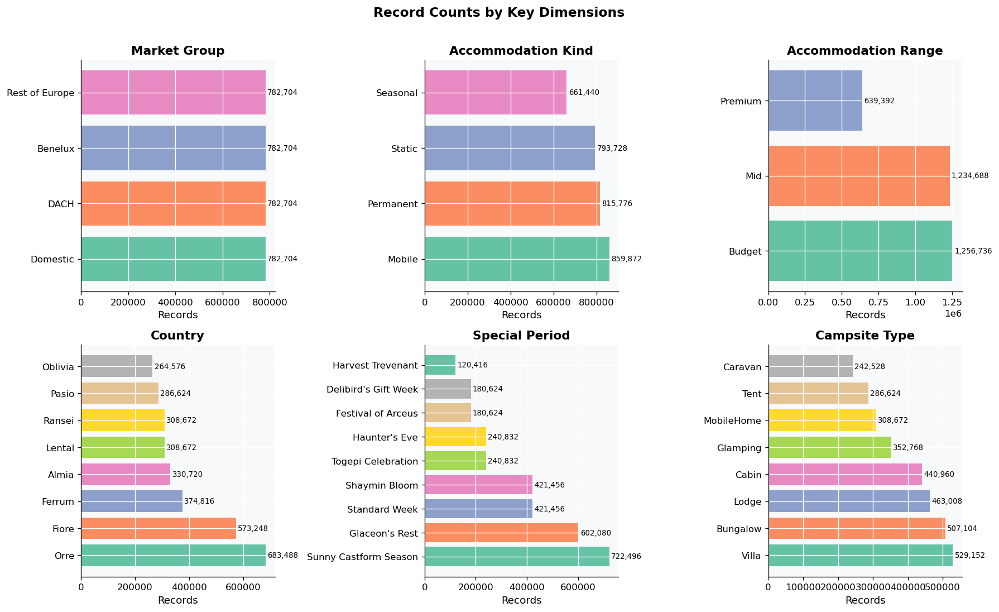
*Figure 1.1 — Record counts by key categorical dimensions.*

---

### 1.2 Key Variables

The variables fall into five functional groups.

**Pricing.** `DiscountedPrice` is the offered price at a given snapshot (the decision variable). `DiscountedPriceLastYear` is the equivalent price from the prior year, present only for products that existed in both years.

**Demand.** `HistoricalBookedNights` records the **incremental** bookings made during the current snapshot week — the weekly demand flow. It is the primary modelling target. `TotalBookedNights` records the final cumulative booked nights at `WeekBeforeArrival = 0`; this is used to compute the occupancy rate. `Capacity` is the total available nights for the arrival week.

**Booking horizon.** `WeekBeforeArrival` (0–52) traces the booking timeline from one year out to arrival. Decreasing values represent advancing time.

**Context.** `SpecialPeriodCode`, `SeasonalCluster`, `ArrivalMonth`, and `AvgTemperature` capture demand-relevant context. `MarketGroupCode` identifies the customer segment.

**Accommodation features.** Physical descriptors — `Bedrooms`, `Bathrooms`, `Sleeps`, `Airco`, `HotTub`, `Tropical`, `TV`, `DeckingType`, `Kitchen` — characterise the accommodation unit and partly explain the price level.

---

### 1.3 Price Landscape

Prices range from approximately €42 to €666, with a median of around €184 and a right-skewed distribution reflecting the span from budget tent pitches to premium lodges. Figure 1.2 shows the price distribution overall, split by accommodation range, and by campsite type.

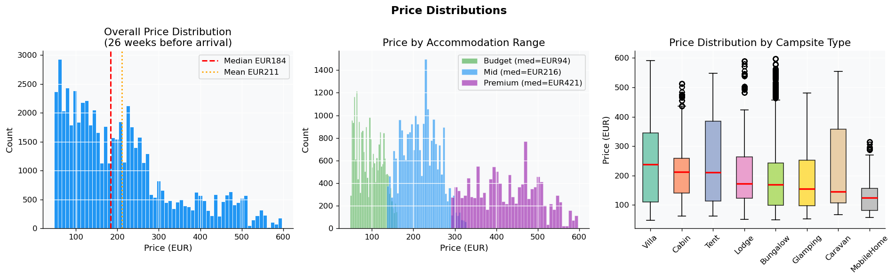
*Figure 1.2 — Price distributions overall (left), by accommodation range (centre), and by campsite type (right) at 26 weeks before arrival.*

Key observations:
- **Budget, Mid, and Premium** ranges are clearly separated in price, confirming that accommodation range is a strong price determinant.
- **Campsite type** introduces further variation: Villa and Lodge types command higher prices than Tent or Caravan types, independent of the accommodation range label.
- Prices vary substantially across countries. Figure 1.3 shows that some countries (fictional labels in the synthetic dataset) are consistently priced higher, pointing to geography as a relevant pricing input.

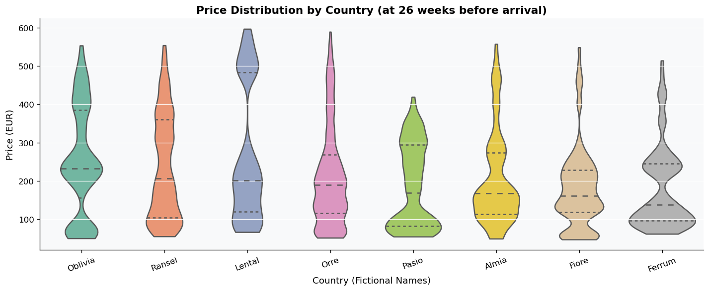
*Figure 1.3 — Price distribution by country (violin plot, at 26 weeks before arrival). Inner lines show quartiles.*

**Price dynamics along the booking horizon** are shown in Figure 1.4. Prices are not static — they vary across `WeekBeforeArrival`, with observable differences in trajectory by accommodation range. This price movement is the core mechanism the optimiser exploits.

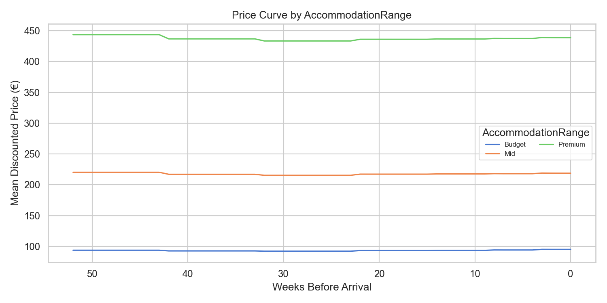
*Figure 1.4 — Mean price along the booking horizon by accommodation range. X-axis runs from 52 weeks (left) to 0 weeks (arrival, right).*

---

### 1.4 Demand and Occupancy

The target variable, `HistoricalBookedNights`, is a non-negative integer count with strong zero-inflation: **74.0% of all snapshots record zero incremental bookings** in that week. The mean is 0.74 nights per snapshot, with a variance-to-mean ratio well above 1 (overdispersed). These properties make ordinary least squares inappropriate and motivate a Poisson-family model.

The final **occupancy rate** (total booked nights divided by capacity) is the business-level outcome. Its distribution, shown in Figure 1.5, is right-skewed with a substantial mass at low values. The median occupancy across all products and weeks is approximately 10%, but individual products in peak season reach 85%.

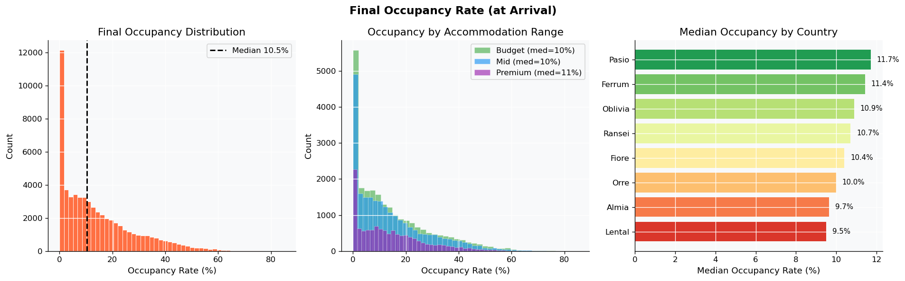
*Figure 1.5 — Final occupancy distribution overall (left), by accommodation range (centre), and median occupancy by country (right).*

Occupancy varies markedly by arrival month. Figure 1.6 shows the expected peak in summer months (June–August) and low occupancy in winter, confirming strong seasonality in demand.

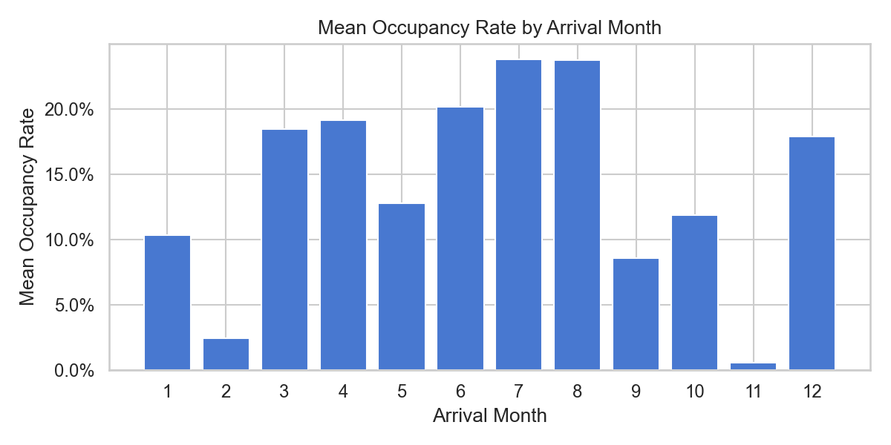
*Figure 1.6 — Mean final occupancy rate by arrival month.*

---

### 1.5 Seasonal and Special Period Effects

Figure 1.7 shows median occupancy and median price by arrival month across both years (2024 and 2025). Both metrics peak in summer, confirming that price and demand are positively correlated at the seasonal level. This is the basic pricing-power signal: in peak months, both willingness to pay and number of potential guests are elevated.

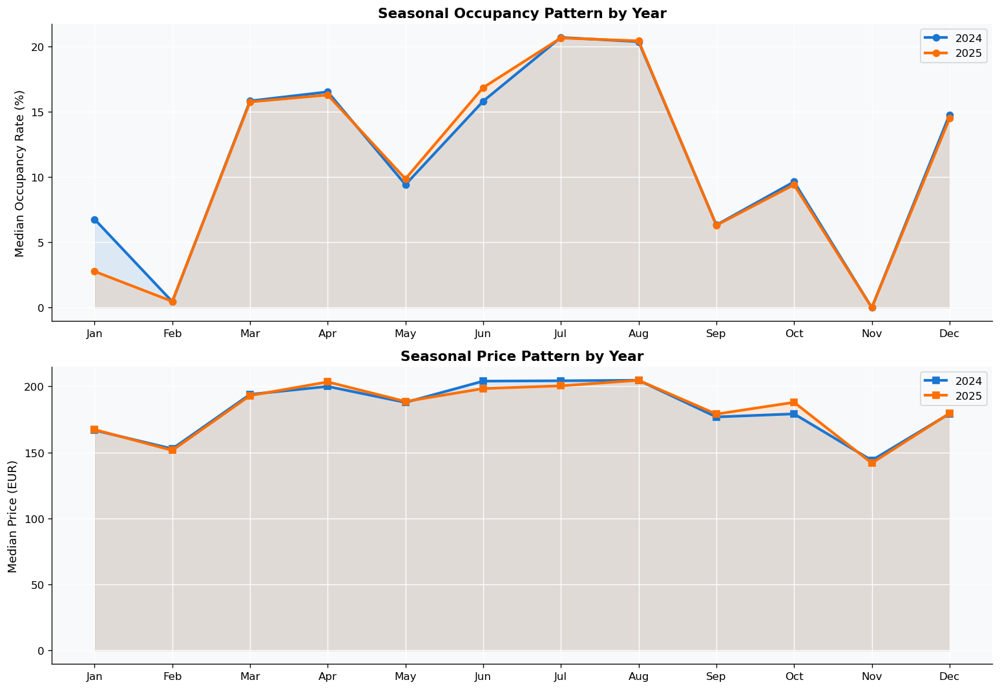
*Figure 1.7 — Seasonal occupancy (top) and price (bottom) patterns by year.*

**Special periods** (school holidays, bank holidays, festival weeks) have a large additional effect on top of the seasonal baseline. Figure 1.8 shows that special-period weeks command both higher prices *and* higher occupancy — these are the highest-value pricing moments.

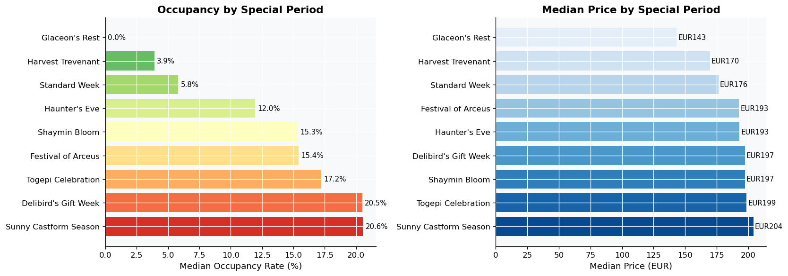
*Figure 1.8 — Median occupancy (left) and median price (right) by special period type.*

The **seasonal cluster × month heatmap** (Figure 1.9) reveals that clusters differ not just in average occupancy but in *which months* they peak. This heterogeneity confirms that a single seasonal pricing rule applied uniformly across all products would be suboptimal; product-level or cluster-level models are necessary.

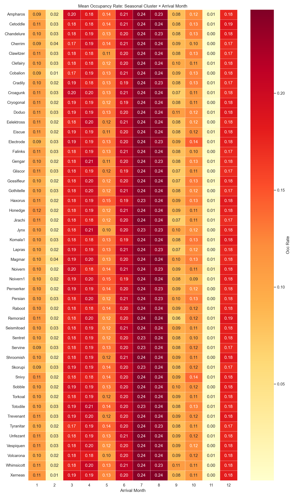
*Figure 1.9 — Mean occupancy rate by seasonal cluster and arrival month. Yellow = high occupancy; darker = low.*

---

### 1.6 Booking Curve Behaviour

The booking curve describes how demand accumulates over the 52-week horizon. Understanding its shape is central to determining *when* prices should be adjusted.

Figure 1.10 shows the average cumulative fill rate, broken down by market group (centre) and accommodation range (right). Several patterns are clear:

- Demand is **concentrated in the final 13 weeks** before arrival. At 26 weeks out, the average product is less than 20% booked.
- **Market groups differ in lead time**: some segments book further in advance than others, implying that the same product should be priced differently for different markets.
- **Premium products** fill more slowly than Budget products in percentage terms at early lead times, consistent with their customers planning more carefully before committing.

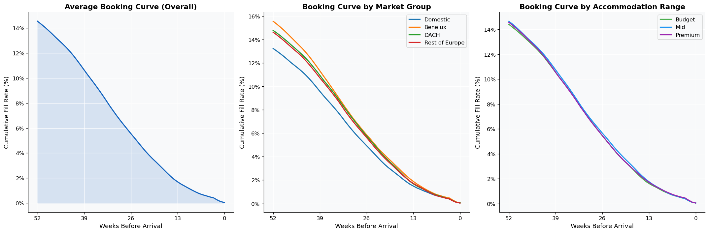
*Figure 1.10 — Cumulative fill rate along the booking horizon: overall (left), by market group (centre), by accommodation range (right).*

Figure 1.11 presents the **booking pace curve** by seasonal cluster — the cumulative share of final demand booked at each horizon week. Clusters diverge substantially, with some filling quickly (steep early rise) and others remaining flat until the final weeks. This heterogeneity reinforces the need for cluster-aware pricing.

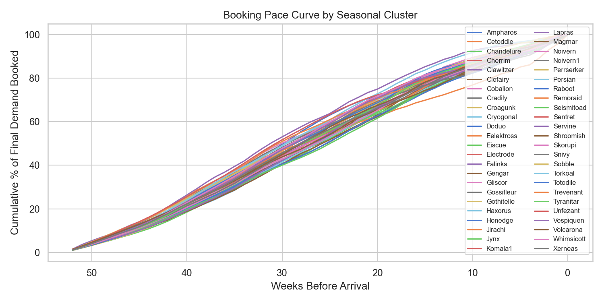
*Figure 1.11 — Booking pace curves by seasonal cluster (cumulative % of final demand booked, from 52 weeks to arrival).*

Special periods also shape the booking curve trajectory (Figure 1.12). Festival and holiday weeks attract bookings earlier relative to standard weeks — guests commit further in advance for known calendar events.

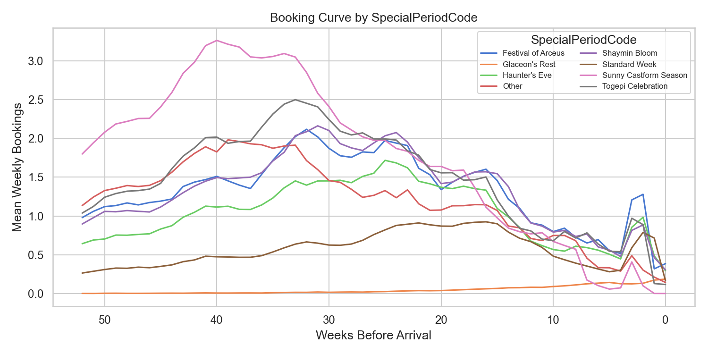
*Figure 1.12 — Mean weekly incremental bookings along the horizon by special period type.*

---

### 1.7 Price–Demand Relationship

Before any modelling, the raw association between price and bookings is visible in Figure 1.13. The scatter shows a downward trend: weeks with higher prices tend to yield fewer bookings, even in this unconditional view. The binned mean lines in Figure 1.14 make this clearer, controlling at least partially for product range.

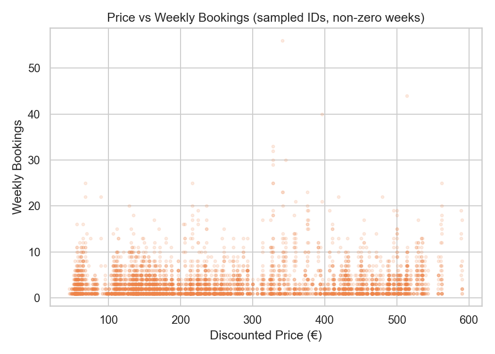
*Figure 1.13 — Price versus weekly incremental bookings for a random sample of 300 products (non-zero booking weeks only).*

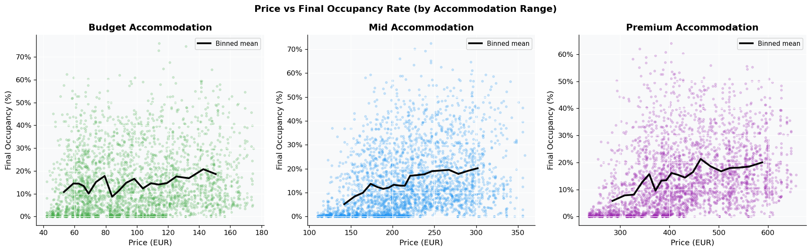
*Figure 1.14 — Price versus final occupancy rate with binned mean trend lines, by accommodation range. The negative slope is clearly visible across all three ranges, with Budget showing the steepest decline.*

The endogeneity check (computed in `eda.py`) finds a small but positive correlation between the current fill rate and subsequent price changes — indicating that prices are sometimes raised in response to strong demand. This means a naive regression of bookings on price would underestimate true price sensitivity, motivating the fixed-effects design used in the elasticity stage (Section 2.3).

---

### 1.8 Summary of EDA Findings

| Finding | Implication for Pricing |
|---|---|
| 74% of weekly snapshots record zero bookings | Target is highly zero-inflated; standard regression will fail |
| Demand peaks June–August, troughs December–February | Seasonal price ladder is necessary |
| Special periods command both higher prices and higher occupancy | Pricing power is real; these weeks should not use standard rules |
| ~50% of bookings arrive in the final 13 weeks | Late-horizon price is the most impactful lever |
| Clusters differ sharply in booking pace and seasonality | Product-level or cluster-level models needed; flat rules hurt revenue |
| Negative price–demand slope visible unconditionally | Demand is price-elastic; pricing too high leaves revenue on the table |
| Budget range more elastic than Premium | Price cuts help Budget products more; Premium can sustain higher prices |
| Prices move along the horizon | Dynamic (time-varying) pricing is already in place; the question is how to optimise it |

---

## 2. Methodology

The solution methodology consists of three sequential analytical stages, each building on the outputs of the previous. A fourth stage produces diagnostic visualisations for model validation and presentation.

```
Data
 └─► Stage 1: Demand Forecasting Model   (01_demand_model.py)
      └─► Stage 2: Price Elasticity Estimation  (02_price_elasticity.py)
      └─► Stage 3: Revenue Optimisation         (03_price_optimization.py)
           └─► Stage 4: Diagnostic Plots        (04_diagnostic_plots.py)
```

### 2.1 Stage 1 — Demand Forecasting Model

**Purpose.** Build a predictive model of weekly incremental bookings (`HistoricalBookedNights`) as a function of price and context. This model is the core engine: by querying it at different hypothetical prices, the optimiser can estimate demand under counterfactual pricing scenarios.

**Approach.** A `HistGradientBoostingRegressor` with a **Poisson loss** is trained on 85% of the data (by arrival date). The Poisson loss is appropriate for count targets with zero-inflation and overdispersion. The model is trained on ~22 features spanning product identity, accommodation characteristics, booking horizon, price (raw and log-transformed), geography, and weather. See Section 3 for the full technical treatment.

**Output.** A serialised model bundle (`models/demand_hgb.joblib`) and test-set predictions (`models/demand_predictions_test.csv`) used in Stages 3 and 4.

### 2.2 Stage 2 — Price Elasticity Estimation

**Purpose.** Independently estimate the causal price elasticity of demand using a transparent, interpretable econometric model that does not rely on the black-box gradient booster. This provides a statistically grounded answer to: *by how much does a 1% price increase reduce weekly new bookings?*

**Approach.** A **Two-Way Fixed Effects (TWFE) panel OLS** regression is estimated using `linearmodels.PanelOLS`:

$$\log(1 + \text{NewBookings}_{it}) = \beta \cdot \log(\text{Price}_{it}) + \alpha_i + \gamma_t + \varepsilon_{it}$$

where $\alpha_i$ are entity fixed effects (one per `ReservableOptionMarketGroupId`, absorbing all time-constant product heterogeneity) and $\gamma_t$ are time fixed effects (one per `WeekBeforeArrival`, absorbing demand patterns common across all products at a given lead time). This design removes the endogeneity bias identified in the EDA by exploiting only within-product, within-horizon price variation.

The outcome `NewBookings` is the **first difference** of `HistoricalBookedNights` within each curve (sorted from week 52 to week 0), representing the *flow* of new bookings per week rather than the cumulative stock. Standard errors are clustered at the entity level.

Stratified elasticities are estimated by **lead-time bucket** and **seasonal cluster** to capture heterogeneity across the booking horizon and product types.

**Pooled and stratified results** are summarised in the table below. All estimates are highly significant (p < 0.001).

| Stratum | Elasticity (β) | Std. Error | Interpretation |
|---|---|---|---|
| **Pooled (all weeks)** | **−1.534** | 0.009 | 1% price rise → −1.53% weekly bookings |
| Lead-time 27–52w | −1.234 | 0.024 | Earliest bookers, least price-sensitive |
| Lead-time 13–26w | −1.906 | 0.033 | **Most elastic** — peak planning window |
| Lead-time 5–12w | −1.318 | 0.049 | Moderate sensitivity |
| Lead-time 0–4w | −1.499 | 0.099 | Last-minute, still elastic |

Demand is **elastic** throughout (all |β| > 1), meaning that price increases reduce revenue unless offset by the price increase itself — the optimal price is finite, not "as high as possible."

The 13–26 week window is the most price-sensitive: guests in the medium-term planning phase are actively comparing options and can be won or lost by price. The very early window (27–52w) is least sensitive, consistent with early-bird bargain hunters who are already committed if the price is in range.

Figure 2.1 plots elasticity by lead-time bucket with 95% confidence intervals, and Figure 2.2 shows the distribution across seasonal clusters.

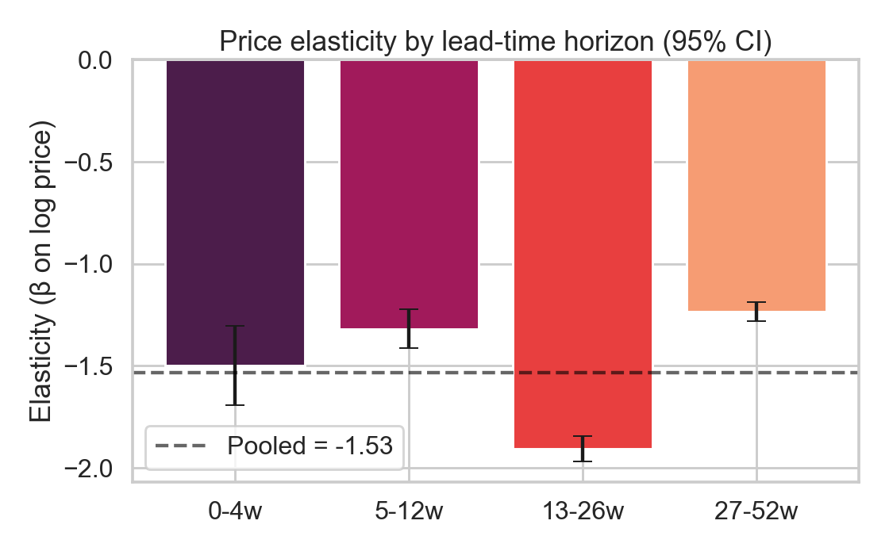
*Figure 2.1 — Price elasticity by lead-time bucket (bars) with pooled estimate (dashed line). Errors are 95% CIs.*

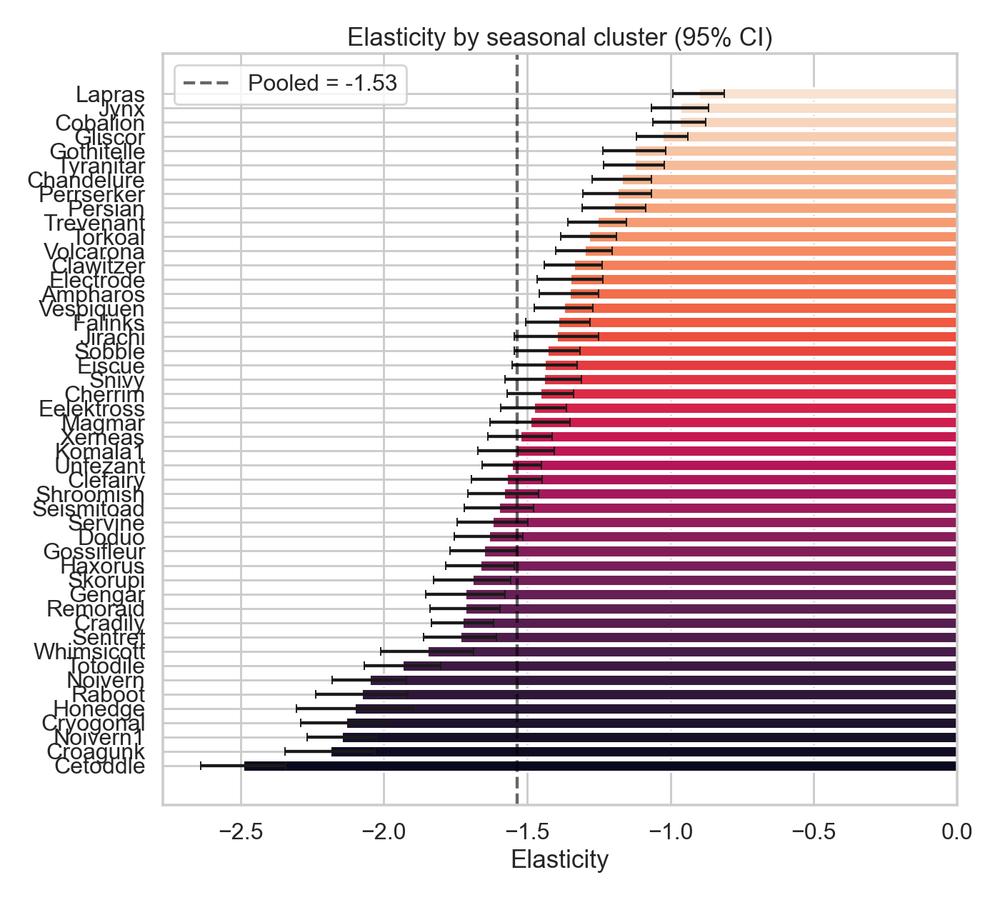
*Figure 2.2 — Price elasticity by seasonal cluster. Range from −0.90 (Lapras) to −2.49 (Cetoddle), indicating that pricing strategy must be cluster-specific.*

### 2.3 Stage 3 — Revenue Optimisation

**Purpose.** For each product in the held-out set, find the price multiplier ladder — one multiplier per lead-time bucket — that maximises expected total revenue over the booking horizon.

**Approach.** A discrete grid search is performed over price multipliers $\{0.85,\ 0.95,\ 1.00,\ 1.05,\ 1.15\}$ applied independently to each of four lead-time buckets, yielding $5^4 = 625$ candidate ladders per product. For each candidate:

1. Replace the observed prices with `multiplier × baseline_price` across all snapshot rows.
2. Score the counterfactual snapshots with the Stage 1 demand model → predicted cumulative bookings.
3. Enforce monotonicity (cumulative bookings cannot decrease over time) and a hard capacity ceiling.
4. Compute revenue as $\sum_t \text{Price}_t \times \Delta\text{Bookings}_t$ across all horizon weeks.

The ladder with the highest expected revenue is selected. The optimisation is applied to 200 randomly sampled hold-out product curves.

**Results.** Figure 2.3 shows the revenue uplift distribution. The **median uplift over baseline is +17.6%**, with a mean of +36.6% (driven by a right tail of products where the baseline price is far from optimal). The pattern of chosen multipliers (Figure 2.4) is consistent with the elasticity findings: discount early (27–52w: modal multiplier 0.85), charge a premium close-in (0–4w: modal multiplier 1.15).

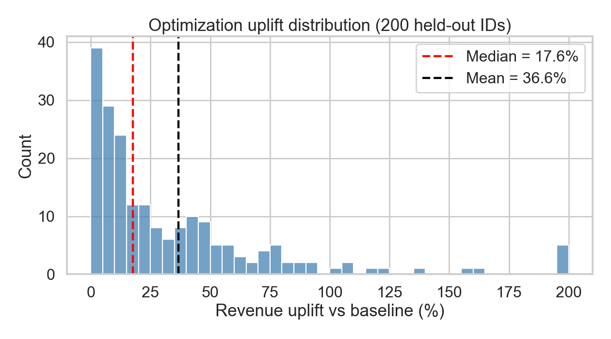
*Figure 2.3 — Distribution of revenue uplift (optimal vs baseline) across 200 held-out products. Median uplift: +17.6%.*

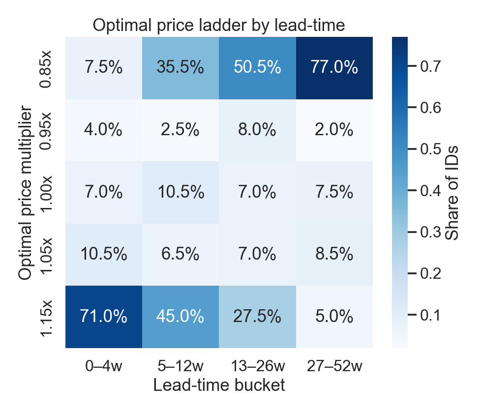
*Figure 2.4 — Frequency heatmap of optimal price multipliers by lead-time bucket. Early-horizon discounts and last-minute premiums dominate.*

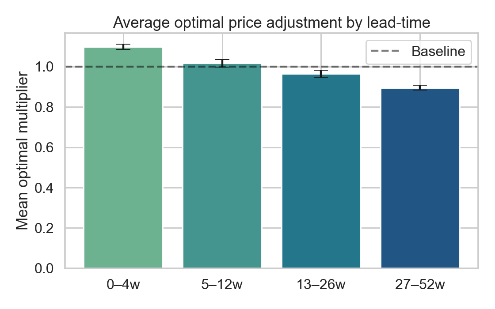
*Figure 2.5 — Mean optimal multiplier per lead-time bucket with 95% confidence intervals. The pattern — discount early, premium late — is the systematic recommendation from the model.*

The early-discount, late-premium ladder exploits two mechanisms simultaneously: it stimulates early bookings when demand is elastic and naturally sparse, securing revenue early and filling capacity; it then captures the price-inelastic last-minute demand at a higher margin when the product is nearly full and alternatives are scarcer.

---

## 3. Demand Modelling

### 3.1 Objective

The demand model predicts **how many nights will be booked in a given week** (`HistoricalBookedNights`) for a specific product at a specific point in its booking horizon, given the current price and all available context. It must:

- Capture the non-linear effect of price on bookings (including near-zero bookings at high prices).
- Distinguish how demand accumulates at different lead times.
- Generalise across the full product space (142 campsites × 5 acco types × 4 market groups × 3 ranges).
- Serve as a scoring engine for counterfactual price simulation in the optimiser.

### 3.2 Algorithm

The model uses **`HistGradientBoostingRegressor`** from scikit-learn with a **Poisson loss function**. This choice is driven by three properties of the target:

| Property | Evidence | Implication |
|---|---|---|
| Non-negative integer count | All values ≥ 0, right-skewed | OLS produces negative predictions |
| Zero-inflation | 74.0% of rows = 0 | Point mass at zero must be handled |
| Overdispersion | Variance >> mean | Standard Poisson GLM too constrained |

Gradient boosted trees with a Poisson objective effectively implement a log-linear conditional mean model — analogous to Poisson regression — while allowing for arbitrary non-linear interactions between features. Crucially, the histogram-based implementation handles **categorical features natively**, is efficient on ~3M rows, and does not require one-hot encoding (which would explode the feature space given the 142-level `CampsiteCode` and `SeasonalCluster` variables).

**Hyperparameters:**

| Parameter | Value | Rationale |
|---|---|---|
| `loss` | `poisson` | Count target with overdispersion |
| `learning_rate` | 0.05 | Conservative; allows many trees |
| `max_iter` | 1000 | Upper bound (early stopping monitors) |
| `max_leaf_nodes` | 127 | Deep trees capture feature interactions |
| `min_samples_leaf` | 200 | Regularisation against sparse cells |
| `l2_regularization` | 1.0 | Shrinkage regularisation |
| `validation_fraction` | 0.15 | Internal split for early stopping |
| `n_iter_no_change` | 30 | Early stopping patience |

### 3.3 Feature Engineering

**Log-price transformation.** Both the raw price and its log-transformation are included:

$$\text{LogPrice} = \log(1 + \text{DiscountedPrice})$$

Logging compresses the right tail and linearises the expected log-linear price–demand relationship. Including both gives the model flexibility to capture non-log-linear responses.

**Lead-time bucket.** `WeekBeforeArrival` is discretised into four interpretable segments:

| Label | Weeks | Typical booking behaviour |
|---|---|---|
| `6_12mo` | 27–52 | Early planners; low weekly volume; low price sensitivity |
| `3_6mo` | 13–26 | Growing interest; highest price sensitivity |
| `1_3mo` | 5–12 | Confirmed intent; moderate volume |
| `last_month` | 0–4 | Last-minute; concentrated high volume |

Including this alongside the numeric `WeekBeforeArrival` allows the model to capture both the fine-grained horizon effect and the discontinuous behavioural shifts between segments.

**Calendar features.** `ArrivalYear` and `ArrivalWeekOfYear` are extracted from `WeekStartDate` to capture long-run trends and within-year seasonality not fully described by `ArrivalMonth`.

**Missing-feature encoding.** For `DeckingType`, `Kitchen`, and `DeckingExtras`, zero and NaN values indicate the *absence* of that feature from the accommodation — not a data quality issue. These are recoded to the string `"None"` before category encoding so the model treats absence as a meaningful distinct category.

**Dropped features.** `DiscountedPriceLastYear`, `HistoricalBookedNightsLastYear`, and `CapacityLastYear` are excluded. These prior-year columns are zero-filled for products that did not exist in the prior year, introducing a confounded signal that the model cannot distinguish from genuine low prior-year demand.

### 3.4 Full Feature Set

| Group | Features |
|---|---|
| Product identity | MarketGroupCode, BrandGroupCode, CampsiteCode, AccoKindCode, AccoTypeRangeCode, AccommodationType, AccommodationRange |
| Temporal context | ArrivalMonth, LeadTimeBucket, SpecialPeriodCode, ArrivalYear, ArrivalWeekOfYear |
| Clustering | SeasonalCluster, CampsiteCluster |
| Geography | CampsiteCountry, CampsiteRegion, CampsiteType, latitude, longitude |
| Amenities | Airco, HotTub, Tropical, Roof, TV, DeckingType, Kitchen, DeckingExtras |
| Booking horizon | WeekBeforeArrival |
| Price | DiscountedPrice, LogPrice |
| Physical | Bedrooms, Bathrooms, Sleeps, Capacity |
| Weather | AvgTemperature |

Total: ~30 features (22 categorical + 9 numeric, some overlap with engineered features).

### 3.5 Train–Test Split

A **time-based split** holds out the most recent 15% of arrival dates for testing, leaving the earlier 85% for training. The cutoff falls roughly at the 85th percentile of `WeekStartDate`.

| Set | Criterion | Approx. size |
|---|---|---|
| Training | `WeekStartDate` ≤ 85th percentile cutoff | ~2.66M rows |
| Test | `WeekStartDate` > cutoff | ~0.47M rows |

A random split is explicitly avoided: it would allow snapshots from future arrival weeks to appear in the training set alongside snapshots of the same curve from earlier in the booking horizon, creating temporal leakage. The time-based split ensures the model must genuinely generalise to arrival weeks it has not seen at any point during training.

### 3.6 Model Performance

The model trained to the maximum of 1,000 iterations (early stopping did not trigger), indicating the model continued to improve throughout.

| Metric | Value |
|---|---|
| Test MAE | **0.714** |
| Test RMSE | **1.839** |
| Test R² | **0.268** |
| Mean actual (test) | 0.735 |
| Mean predicted (test) | 0.619 |
| Zero rate — actual | 74.0% |
| Zero rate — predicted | 69.3% |

**Contextualising R² = 0.268.** An R² of 27% at first appears modest, but must be interpreted in context. The target is dominated by zeros (74% of test rows) and has very high irreducible noise at the individual snapshot level — most of the variance in any given week's bookings is random and unforecastable from product features alone. What matters for the downstream optimiser is that the model correctly captures the *relative effect of price* and the *systematic patterns across the booking horizon and product space*. Both are confirmed by the diagnostic plots below.

**Predicted vs actual booking curve.** Figure 3.1 averages the model's predictions and the actual values by `WeekBeforeArrival` across the test set. The model reproduces the shape of the booking curve — near-zero at early lead times, rising sharply in the final weeks — with close alignment to the actual mean. Slight under-prediction at the final few weeks reflects the Poisson loss's tendency toward conservative mean estimates.

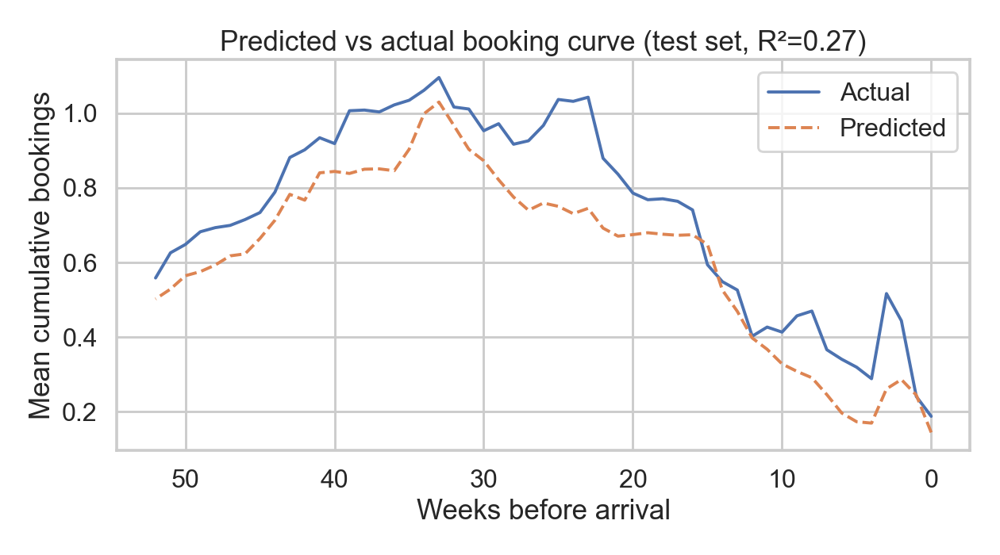
*Figure 3.1 — Mean predicted vs mean actual incremental bookings by weeks before arrival (test set).*

**Calibration.** Figure 3.2 confirms that across 20 predicted-value quantile bins, the mean predicted value tracks the mean actual value closely. This is the property that matters most for the price optimiser: the model's predictions are correctly ranked and proportionally scaled, ensuring that the revenue comparison across 625 price ladders is meaningful.

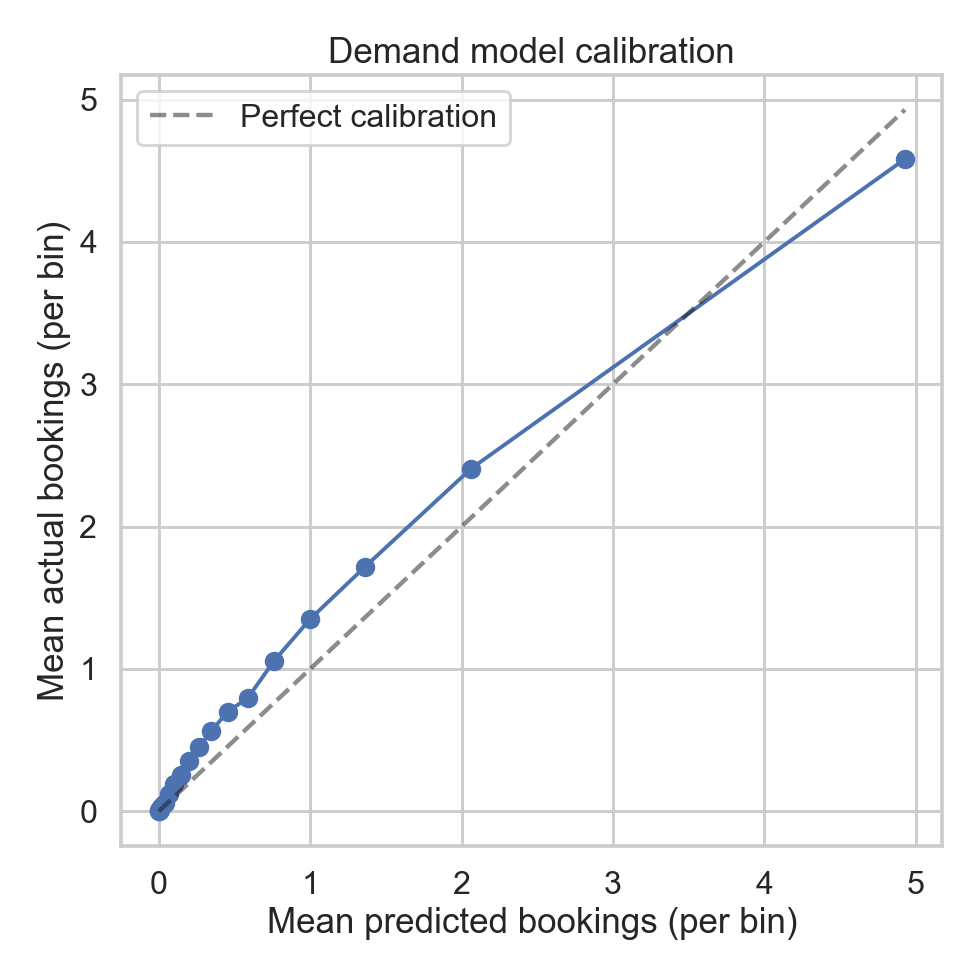
*Figure 3.2 — Calibration plot: mean predicted bookings per bin vs mean actual bookings per bin. Points close to the diagonal indicate well-calibrated predictions.*

The slight under-prediction of mean bookings (0.619 vs 0.735) and of zero rates (69.3% vs 74.0%) — meaning the model predicts some bookings where there were none — is a known consequence of the Poisson loss, which asymmetrically penalises underestimation of positive counts. For the optimiser, this systematic level shift is inconsequential: revenues are compared *relative* to baseline across price ladders, so a constant downward bias cancels out.

### 3.7 Key Drivers and Interpretation

While gradient boosted trees do not yield coefficient-style interpretability, the model structure, the elasticity analysis, and the EDA together support the following claims about what drives predictions.

**Booking horizon** (`WeekBeforeArrival`, `LeadTimeBucket`) is the single strongest structural driver. Weekly bookings are near-zero 52 weeks out and rise sharply in the final 13 weeks. The model's ability to reproduce the booking curve shape (Figure 3.1) confirms that it has learned this temporal pattern well.

**Price** (`DiscountedPrice`, `LogPrice`) is the primary actionable driver. The TWFE elasticity of −1.53 (Figure 2.1) quantifies the price response captured by the model. Within-product price variation — caused by dynamic price adjustments along the horizon — is the primary identification source.

**Special period** has a large positive effect on demand at all lead times. Products in school-holiday or festival weeks receive substantially more bookings than standard weeks at the same price, implying considerable pricing power that should not be left unused.

**Seasonal cluster** and **campsite cluster** capture persistent product-level demand heterogeneity. High-demand clusters (those with steep booking curves and high occupancy) also tend to show stronger price sensitivity (elasticities of −2.1 to −2.5 for clusters such as Cetoddle, Noivern), while lower-demand clusters exhibit weaker sensitivity (−0.9 to −1.0 for Lapras, Jynx, Cobalion). This interaction between baseline demand and elasticity is a key input for differentiated pricing strategies.

**Accommodation range** (Budget, Mid, Premium) affects both the price level and the demand responsiveness. The EDA confirms that Budget products attract a more price-elastic customer base, making early-horizon discounts more effective for volume-building in that segment. Premium products sustain higher prices with lower absolute sensitivity.

**Geography and weather** (`CampsiteCountry`, `latitude`, `longitude`, `AvgTemperature`) contribute seasonally modulated effects. Temperature correlates with summer occupancy peaks; country-level effects reflect differences in domestic and international market composition.

**Amenities** (`Airco`, `HotTub`, `Tropical`) are important price-level features but show more modest independent effects on bookings volume, as they are partly collinear with accommodation range.

### 3.8 Limitations

**Endogeneity of price.** The EDA reveals a small positive correlation between the current fill rate and subsequent price changes, indicating that prices are sometimes raised in response to strong early demand. The gradient boosting model does not fully account for this: it may partially absorb the effect of strong underlying demand as a price effect, causing it to underestimate the true causal price sensitivity. The TWFE elasticity estimate (Section 2.2) addresses this through entity fixed effects; the optimiser should be understood as providing a *relative ranking* of price ladders rather than exact revenue forecasts.

**Zero-inflation structure.** The Poisson loss handles overdispersion but is not a two-part model. An explicit hurdle model — predicting the probability of any booking first, then the expected count conditional on at least one booking — could improve performance on the zero-vs-nonzero classification (current gap: 74.0% actual vs 69.3% predicted).

**Excluded prior-year features.** `DiscountedPriceLastYear` and `HistoricalBookedNightsLastYear` are natural demand anchors that, if properly imputed or modelled, could reduce prediction error for products with stable year-over-year patterns. The current approach conservatively excludes them to avoid missingness-driven bias.

**Temporal generalisability.** The model is trained on 2024 data and validated on late-2025 arrival weeks. Significant structural shifts between training and deployment — new product launches, macroeconomic shocks, changes in competitor pricing — would degrade accuracy and require periodic retraining (recommended quarterly).

---

## Summary

| Aspect | Details |
|---|---|
| Dataset | 3.13M rows, 38 columns, panel of ~59,000 booking curves across 2 years |
| Target | `HistoricalBookedNights` — weekly incremental bookings (74% zeros) |
| Algorithm | HistGradientBoostingRegressor, Poisson loss |
| Split | Time-based 85/15 by arrival date |
| Key engineered features | LogPrice, LeadTimeBucket (4 bins), ArrivalYear, ArrivalWeekOfYear |
| Test MAE | 0.714 (vs mean actual 0.735) |
| Test R² | 0.268 |
| Price elasticity (pooled TWFE) | −1.534 — elastic demand throughout the horizon |
| Most elastic lead-time | 13–26 weeks before arrival (β = −1.906) |
| Optimal pricing pattern | Discount early (0.85× at 27–52w), premium close-in (1.15× at 0–12w) |
| Median revenue uplift | +17.6% over baseline on 200 held-out products |
